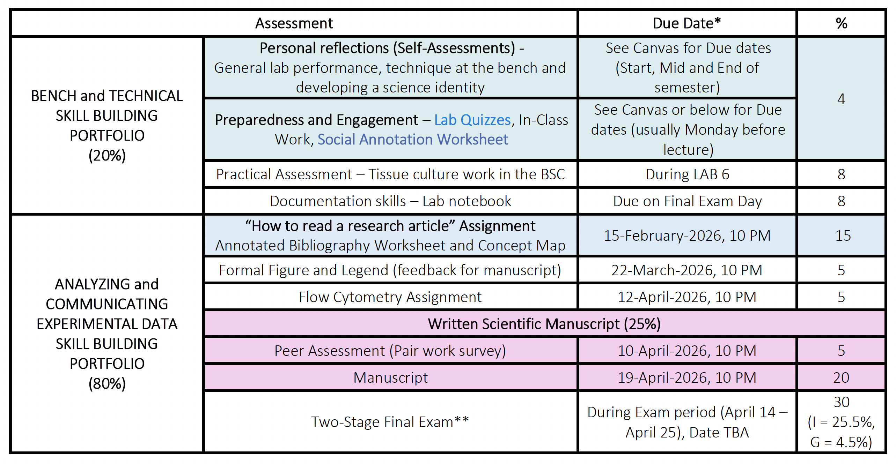

#### *A NOTE ABOUT DUE DATES
Due dates listed on Canvas and discussed in class are considered “best by” dates. We provide dates to help you stay on track and progress in an optimal way to help your learning. For example, if you prepare for your labs in advance and complete the quizzes on time, you will get the most out of the lab experience by knowing the background and understanding the procedures. If you complete the exercises on how to critically read primary papers on time, this will help you with the “how to read a research article” major assignment, and so on.

However, life happens, we get it. For any assignment, everyone is permitted a 2-day grace period without needing to contact us. If you anticipate needing more time or experiencing extraordinary challenges hindering your learning in MICB 323, please reach out to us so we can help you. For some assignments, it is extra important to submit on time, or at least within the 2-day grace period, so we can give you feedback in a timely way and coordinate how our team proceeds with the grading. These major assignments include:

- "How to read a research article” Assignment
- Formal Figure and Legend – feedback for manuscript
- Written Scientific Manuscript

#### **Two Stage Final Exam
We have adopted a two-stage final exam to mirror the teamwork experience from the labs. The first stage shows your individual understanding, and the second lets you apply problem-solving and critical-thinking skills as a group to deepen and showcase your learning. The individual component is worth 85% and the group component is worth 15%. If you happen to score lower on the group stage than on the individual stage, the individual grade will account for the entire exam grade.
